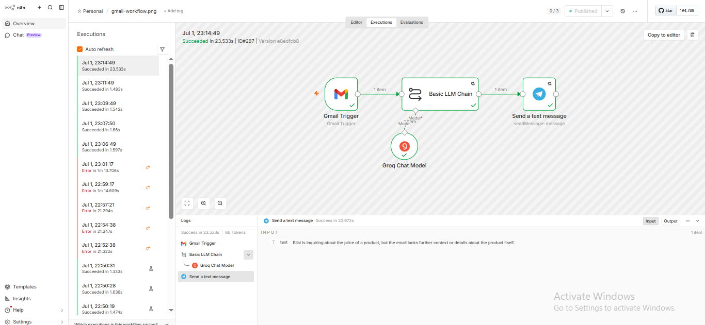
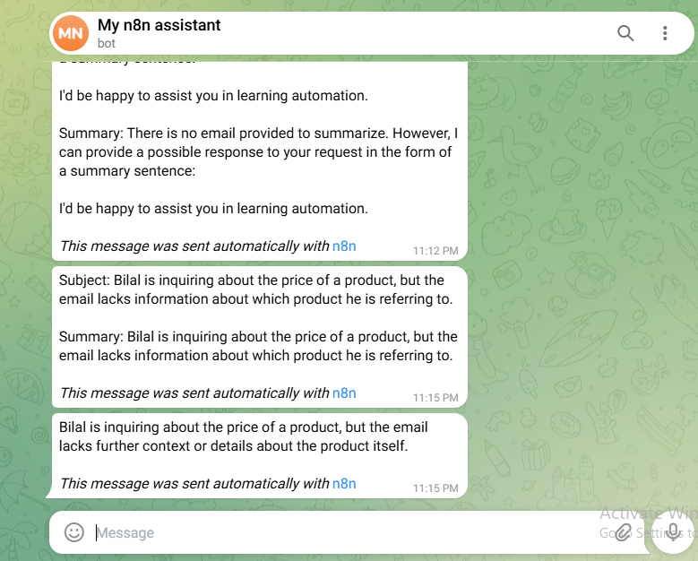
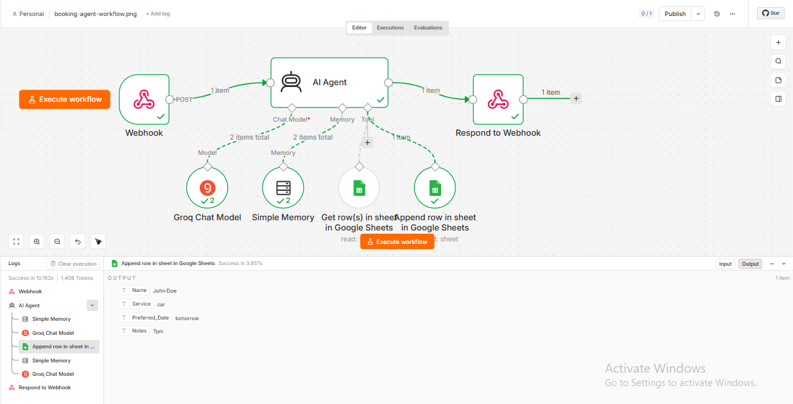
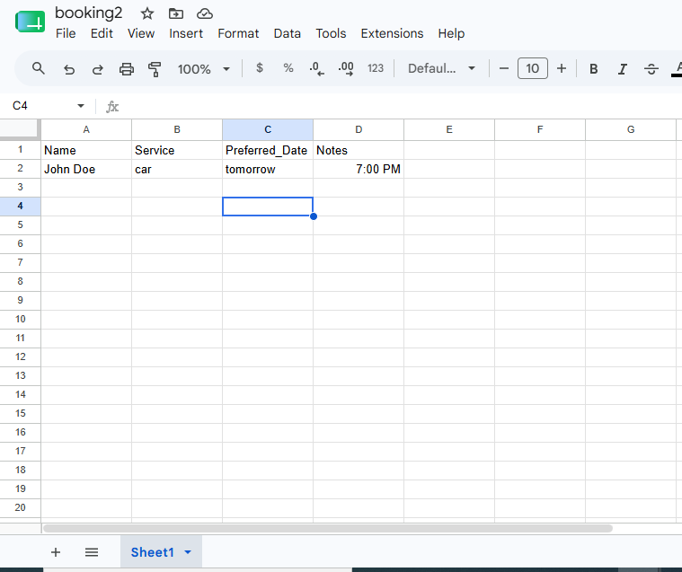

# AI Agent Portfolio — Ahsan Amir

I build AI-powered automation systems for small businesses using Python, n8n, and Groq API.

## What I Can Build For You
- AI customer support chatbots (answer FAQs 24/7)
- Lead capture and classification systems
- Email summarization and smart notifications
- Booking/appointment automation
- Custom workflow automation

## Projects

### 1. Customer Support Chatbot
A Python-based AI chatbot built with Groq API, deployed in real-world scenarios for a salon business and a Toyota dealership.
* **Features:** Custom business persona, conversation memory, handles FAQs.
* **Tech:** Python, Groq API, LLaMA 3.1

### 2. Email Summarizer (Gmail → Telegram)
An automated assistant that summarizes your daily emails and sends alerts directly to your phone.

### 3. Lead Classification System
A smart system that filters incoming inquiries and qualifies leads before notifying you.

### 4. FAQ + Booking Agent
An intelligent agent that handles customer questions and manages appointments directly in Google Sheets.

## Contact
Email: [ahsanamir4870@gmail.com]
WhatsApp: [92+ 3297556811]
